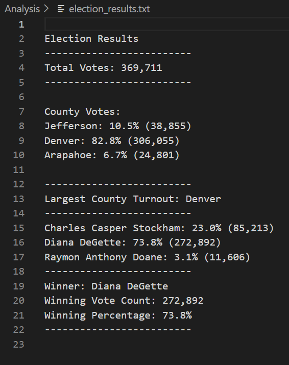

# Election_Analysis

## Challenge Overview
The purpose of this project is to write a Python script that performs an audit for The Colorado Board of Elections' local congressional election. Provided with a CSV file of the election results, the following tasks are to be completed in this project:

1. Calculate the total number of votes cast.
2. Get a complete list of candidates who received votes.
3. Calculate the total number of votes each candidate received.
4. Calculate the percentage of votes each candidate won.
5. Determine the winner of the election based on popular vote.

After completing the audit, the final analysis is saved in a text file.

## Resources
- Data Source: election_results.csv
- Software: Python 3.9.1, Visual Studio Code, 1.54.1

## Election-Audit Results
The result of the audit shows that:
- There were 369.711 total votes cast in the election
- The county results were:
    - Jefferson received 10.5% of the vote, which was 38.855 votes.
    - Denver received 82.8% of the vote, which was 306,055 votes.
    - Arapahoe received 6.7% of the vote, which as 24,801 votes.
    As a result,  Denver county had the largest number of votes.
- The candidate results were:
    - Charles Casper Stockham received 23.0% of the vote, which was 85,213 votes.
    - Diana DeGette received 73.8% of the vote, which was 272,892  votes.
    - Raymon Anthony Doane received 3.1% of the vote, which was 11,606  votes.
- The winner of the election was:
    - Diana DeGette, who received 73.8% of the vote, which was 272,892 votes.

## Summary
As the script reads the CSV file and stores the data it needs to perform the analysis, it is designed to automate the analysis process. This script is able to perform analysis on any polls or elections, given a CSV file with similar data rows, with just a little twist in the names of variables. For instance, to perform a poll on you favorite singer, one can change any variable with "candidate" into "singer", and "county" into "country". If the CSV file follows a different sequence for colomns, the correct data can be extracted by changing the row count from row[x] to row[y], where y is the column that contains the desired data. Another example to utilize this script is a poll for favorite Netflix movie. With validation on voters just like the "Ballot ID" in the CSV file for this project, an analysis can be performed simply by changing the variable "candidate" into "movie". A more thorough analysis can also be performed to find out which release year has the most votes, or which director has the most votes, etc. by extracting those data from the CSV file and store them in a variable that represents their data. As a result, this script can perform analysis on elections or polls on automation.